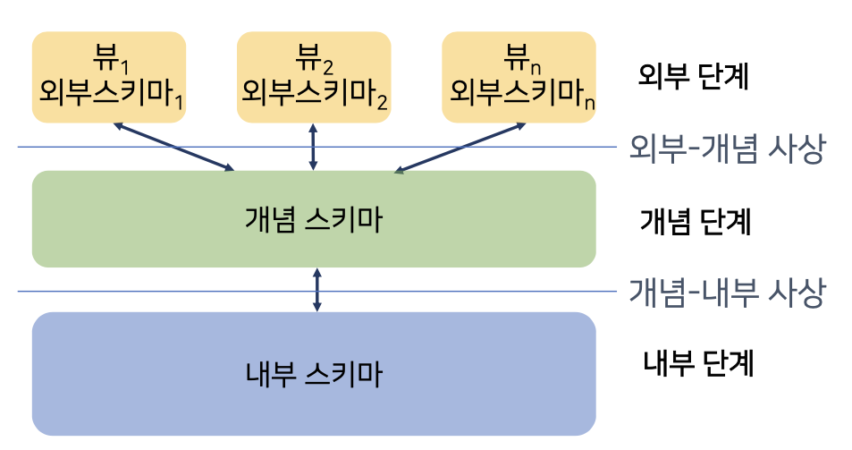

# 1. 데이터베이스의 이해

### 1. 데이터베이스의 정의
1. 많은 수의 데이터를 저장
2. 필요시 원하는 데이터를 빠른 시간에 검색 및 사용 가능하게하는 장치

### 2. 데이터베이스의 개요
1. 데이터베이스 관리 시스템(DBMS: DataBase Management System)
   1. 한 조직의 연관된 데이터의 집합을 다수의 사용자가 공용으로 사용하기 위해 통합 저장하는 소프트웨어 패키지
2. 데이터베이스 시스템
   1. DBMS + 사용자에게 서비스 형태로 제공되는 애플리케이션

### 3. 데이터베이스 관리 시스템의 목적
1. 기존에는 파일 처리 시스템으로 데이터를 관리
2. 여기에서 오는 문제점들이 많음
   1. 데이터의 종속
      1. 데이터가 특정 프로그램에 종속 될 경우
      2. 데이터의 논리적인 구조나 위치는 해당 프로그램만 알고 있음
      3. 그로 인해 공유 불가
      4. 유지보수 비용이 늘어남
   2. 데이터의 중복
      1. 하나의 사항의 데이터가 여러 파일에 중복 저장되는 문제
         1. 일관성문제
            1. 여러군데에 저장되어 있으므로 일관성을 유지하기가 매우 힘듬
         2. 보안성 문제
            1. 여러군데에 저장되어 있으므로 같은 수준의 보안성을 유지하기가 매우 힘듬
         3. 경제성 문제
            1. 같은 데이터를 저장하는데 추가적인 저장 공간 요구
   3. 데이터의 무결성 훼손
      1. 무결성: 데이터의 정확성
      2. 중복으로 인한 일관성에 문제가 있으므로 이 역시 문제임.
   4. 동시 접근 이상
      1. 동시에 접근할 경우 비정상적인 데이터 수정이 일어날 수 있음.
      2. 예) 이중출금.

### 4. 데이터베이스 관리 시스템의 특징
1. 프로그램과 데이터틔 독립성 및 추상화
   1. 데이터의 종속 및 중복문제 해결
   2. 공용으로 사용 할 수 있도록 프로그램과 데이터를 중재하는 에이전트
2. 자기 기술성
   1. 데이터와 데이터의 정의 및 설명(메타데이터)을 포함
   2. 메타데이터: 파일의 구조, 데이터 타입, 저장 형식, 제약 조건 등
   3. 시스템 카탈로그 또는 데이터 사전에 저장
3. 다중뷰
   1. 각 사용자가 관심을 갖는 데이터베이스의 일부만을 표현할 수 있는 기능 제공
4. 다수 사용자 요청 처리
   1. 단일 논리적인 작업을 수행하는 일련의 데이터베이스 명령의 집합인 트랜잭션과 동시성 제어 기능 내장
   2. 동일한 데이터를 동시에 변경하는 경우에도 데이터의 일관성을 보장 + 동시에 작업 수행

### 5. 데이터베이스 관리 시스템의 구조
1. 데이터 추상화
   1. 내부 단계
      1. 가장 낮은 추상화 단계
      2. 아래와 같이 구체적인 사항을 저장한다.
         1. 원시 수준 데이터 구조
         2. 저장된 레코드 유형
         3. 인덱스 유무
         4. 저장된 컬럼의 표현방식
         5. 저장된 레코드의 물리적 순서 
   2. 개념 단계
      1. 데이터베이스의 전체 구조를 추상화하는 단계
      2. 개념스키마를 통해 기술
      3. 다음이 기술된다
         1. 무엇이 저장되어있는지
         2. 데이터간의 관계가 무엇인지
      4. 다음과 같은 부가적인 특징이 있다.
         1. 보안성 검사
         2. 무결성 검사
   3. 외부 단계
      1. 최상위 추상화 단계
      2. 뷰에 의해 기술된다.
      3. 사용자가 관심이 있는 데이터베이스의 일부만 기술한다.
2. 단계 간 사상
   1. 외부-개념 사상
      1. 뷰와 개념 스키마간의 대응 관계 정의
      2. 개념스키마가 변경되더라도 외부-개념 사상에 반영이 되면 외부 스키마에는 영향이 없다.
      3. 논리적 데이터 독립성 확보
   2. 개념-내부 사상
      1. 개념 단계의 데이터 스키마가 디스크 내의 내부 필드와 어떻게 대응하는지를 정의
      2. 데이터에 물리적인 변경이 있더라도 개념-내부 사상에 반영시키면 개념 스키마에는 영향이 없다.
      3. 물리적 데이터 독립성 확보
3. 

### 6. 데이터베이스 언어
1. 유저가 데이터베이스를 쉽게 다룰 수 있는 언어 형태의 인터페이스
   1. DDL: Data Definition Language
      1. 데이터(스키마) 정의 언어
      2. 데이터베이스 객체를 생성, 수정, 삭제하기 위한 언어
      3. DDL의 요구 기능
         1. 프로그램이 요구하는 데이터의 논리적 구성이나 특징을 데이터 모델에 의거하여 규정
         2. 데이터가 기억장치에 저장되도록 데이터의 물리적 구성을 규정
         3. DBMS가 물리적 구성을 논리적 구성으로 변환할 수 있도록 데이터의 물리적 구성과 논리적 구성 간의 사상을 규정
   2. DML: Data Manipulation Language
      1. 데이터 갱신과 질의 표현
      2. 구조화된 데이터에 사용자가 접근 및 조작할 수 있도록 지원하는 언어(검색, 삽입, 삭제, 수정)
      3. DML의 요구 조건
         1. 데이터 조작이 쉽고 간편
         2. 데이터 조작 기능이 정확하고 완전
         3. 사용자의 요청을 시스템 내부에서 효율적으로 처리 가능
      4. 유형분류
         1. 절차적 DML
            1. 사용자가 필요한 데이터를 어떻게 구할 것인지를 구체적으로 명시
         2. 선언적 or 비절차적 DML
            1. 사용자가 요구하는 데이터가 무엇인지만 기술하는 유형
            2. 데이터가 만족해야하는 조건만 기술하기 때문에 사용이 용이하다는 장점
            3. 비효율적으로 처리될 수 있다는 단점

### 7. 데이터베이스 시스템 아키텍처
1. 중앙집중식 데이터베이스 관리 시스템 구조
   1. 중앙 서버에 너무 많은 부하 집중
   2. 병목 현상으로 인한 전체적인 성능 저하
   3. 하드웨어 및 소프트웨어적 오류 발생 시 전체 시스템 중단
2. 클라이언트-서버 구조
   1. 프로그램의 부하는 분산
   2. 시스템의 성능 향상
   3. 프로그램의 유지보수 비용 절감
   4. 이식성 증가
   5. 현대에 가장 널리 적용 중
   6. 2계층과 3계층으로 나뉨
      1. 2계층 클라이언트 서버 구조
         1. 단순함
         2. 기존 시스템과의 하위 호환성이 좋음
         3. 클라이언트 프로그램이 DBMS과 통신하는 방식
         4. 질의 처리와 트랜잭션 기능은 서버에 있음
      2. 3계층 클라이언트 서버 구조
         1. 클라이언트-애플리케이션 서버-데이터베이스 서버로 구성됨
         2. 애플리케이션 서버는 비즈니스 규칙(프로시저 또는 제약조건)들을 저장하는 중간 역할 수행
3. 

### 8. 데이터베이스 사용자 및 관리자
1. 데이터베이스 사용자
   1. 4가지 유형으로 분류된다
      1. 일반 사용자
         1. 작성된 프로그램을 사용하여 데이터베이스 시스템에 접근하는 비전문 사용자
      2. 애플리케이션 프로그래머
         1. 프로그램을 작성하는 컴퓨터 전문가
         2. 사용자 인터페이스 개발
      3. 전문 사용자
         1. SQL이나 데이터 분석 소프트웨어를 사용하여 DBMS를 조작할 수 있는 사용자. + 데이터 분석가
      4. 특수 사용자
         1. 전문사용자 중 전통적인 데이터 처리 프레임워크에 속하지 않는 CAD시스템, 지식기반 전문가 시스템, 복합 데이터 타입 을 저장하는 사용자
2. 데이터베이스 관리자(DBA)
   1. 데이터베이스와 DBMS, 관련 소프트웨어를 관리하고 감독하는 사람 및 집단
   2. 여러 사용가자 필요로 하는 정보에 대한 요건을 결정하고 그들의 필요로 하는 뷰를 제공
   3. DBA의 임무
      1. 설계
         1. 내부 스키마, 개념-내부 사상 및 외부-개념 사상을 명시하고 스키마와 데이터 사전도 구성
         2. 보안 절차 수립
         3. 백업과 회복(recover) 절차를 마련함으로 데이터베이스의 무결성을 항상 유지할 수 있도록 해야함
      2. 관리
         1. 사용자의 요구를 이해하기 위한 소통
         2. 기준과 설치에 관여
      3. 운용 및 통제
         1. 사용자의 요구나 데이터를 이용하는 패턴에 따라 데이터베이스에 대한 최적의 물리적 저장구조뿐만 아니라 저장매체를 선택, 유지한다.
      4. 성능 측정
         1. 효율성과 경제적인 효용성을 높이기 위해
            1. 자원사용 분석
            2. 병목현상 조사
            3. 데이터 이용 형태 조사
            4. 각 장치별 성능 측정
         2. 등을 수행해야한다.
         3. 물리적 저장 구조 재구성 및 데이터 접근 방법을 갱신한다.