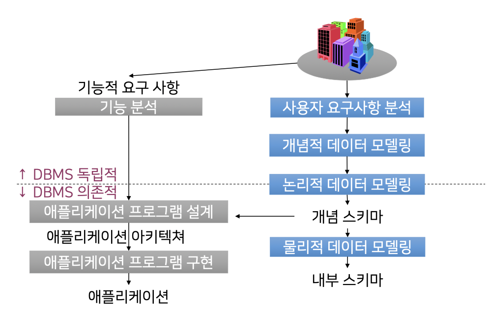
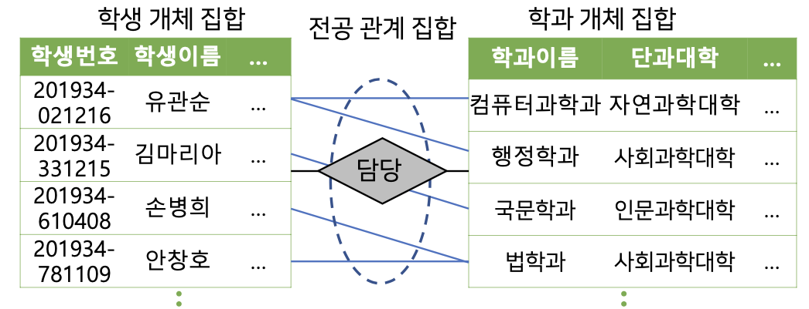
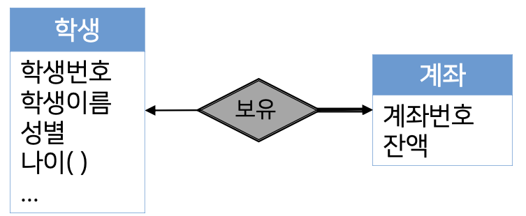

# 2. 데이터베이스 모델링

### 1. 데이터베이스 모델링의 이해
- 실세게의 정보를 사용하여 여러 프로그램을 구축하기 위해서는
- 해당 정보를 특정 데이터 모델의 표기법으로 변환하는
- 정보의 추상화 과정 즉 데이터 모델링이 선행되어야 한다.

1. 사용자 요구 사항 분석
   1. 요구사항 도출 <-> 요구사항 분석 <-> 요구사항 기록
   2. 요구사항 도출
      1. 요구사항 명세서 도출
   3. 요구사항 분석 단계
      1. 도출된 요구사항이 모호한지 판단
      2. 요구사항 정의서 작성
   4. 요구사항 기록 단계
      1. 요구사항 목록을 정리하여 문서화 작업
2. 데이터 모델링 단계
   1. 데이터에 대한 요구사항을 정의하고 분석하여 추상화하는 과정
   2. 표현 대상은 다음 세가지 범주로 구분 가능
      1. 데이터 관점
         1. 업무가 어떤 데이터와 관련이 있는지
         2. 데이터 간의 관계는 어떠한지 표현
      2. 프로세스 관점
         1. 업무를 통해 어떤 일(연산)을 처리하는지
         2. 무엇을 해야하는지 표현
      3. 데이터-프로세스 상관 관점
         1. 업무에서 일을 처리하는 방법에 따라 
            1. 어떤 데이터가
            2. 어떻게 영향을 받는지
         2. 표현
   3. 개념적 데이터 모델링
      1. 요구사항의 해석 요류 방지
      2. 실세계의 데이터를 개념적으로 일반화시켜 데이터 구조, 데이 터 타입, 속성, 관계, 제약조건 등을 이끌어내는 과정
   4. 논리적 데이터 모델링
      1. 특정 DBMS의 구현 모델에 맞춰 데이터를 표현하는 과정
      2. 데이터 정의 언어로 기술된 개념 스키마 생성
   5. 물리적 데이터 모델링
      1. 데이터베이스 파일의 내부 저장구조, 파일 구성, 인덱스, 접근 경로 등을 결정하는 과정

### 2. 사용자 요구사항 분석 과정
1. 사용자 요구사항의 필요성
   1. 사용자의 요구를 명세하지 않고 데이터베이스 설계 및 개발을 진행하는 경우
     1. 결과물의 완성도 저하 및 사용자 신뢰도 추락
     2. 개발 후,발생하는 에러 수정에 많은 추가 비용 지출
   2. 시스템의 대상이 되는 업무를 분석
      1. 정보 시스템의 데이터베이스가 신속하고 효과적으로 업무 처리를 지원
      2. 필요한 데이터를 저장 및 운용 할 수 있는 구조 개발
2. 사용자 요구사항 분석
   1. 데이터에 대한 충분한 사전 분석없이 적절한 설계가 불가능
      1. 데이터베이스의 활용 범위가 확대됨에 데이터베이스의 효율적 운용에 초점
      2. 데이터베이스의 구조가 점차 복잡해지고 수명 주기가 단축되고 때문에 신속, 정확성이 요구
   2. 도출, 분석, 기록 단계로 수행
      1. 국제 표준화: IEEE-Std-830
  

### 3. ER모델
- 데이터베이스의 논리적인 구조를 표현하는 데이터 모델링 도구

1. 개체 집합
   1. 개체(entity)
      1. 실세계에 존재하는 다른 객체와 구별되는 유무형의 사물
      2. 개체를 설명하는 여러 속성들로 구성
   2. 개체 집합(entity set) 
      1. 같은 속성을 공유하는 개체들의 모임

2. 관계 집합
   1. 관계
      1. 개체와 개체 사이의 연관성
   2. 관계 집합 
      1. 개체 집합 간의 전체적 연결 관계
      2. 2개 이상의 개체 집합 간의 수학적인 연결 관계

3. 속성
   1. 개체를 구체적으로 설명하는 특성
   2. 속성에 포함될 수 있는 값의 특성에 따라 여러 종류로 구분
   3. 속성의 종류
      1. 단순속성과 복합속성
         1. 단순 속성
            1. 더이상 작은 구성 요소로 나눌 수 없는 속성
         2. 복합 속성
            1. 더 작은 구성요소로 나눌 수 있는 속성
         3. 
      2. 단일값 속성과 다중값 속성
         1. 단일값 속성
            1. 하나의 개체에 대해 단 하나의 값만을 갖는 속성
         2. 다중값 속성
            1. 하나의 개체에 대해 여러개의 값을 갖는 속성
         3. 
      3. 유도 속성과 저장속성
         1. 유도 속성
            1. 다른 속성의 값으로부터 값이 유추될 수 있는 속성
         2. 저장 속성
            1. 유도 속성을 위해 사용될 수 있는 속성
         3. 
      4. 널(null) 속성

4. 제약조건
   1. 데이터 모델은 데이터, 의미, 구조, 연관성 및 데이터의 조건을 표현하기 위한 도구
   2. ER 모델은 개체와 관계에 대한 표현의 정확성을 위해 데이터가 항상 준수해야 하는 제약조건을 정의할 수 있는 방법을 제공
   3. 제약조건(constraints)의 종류
      1. 사상수
      -  관계 집합에 참가한 개체 집합들에 대해 각각의 개체가 얼마만큼의 관계를 맺을 수 있는지 명시한 수
         1. 일대일 관계
            1. 
            2. 
         2. 일대다 관계
            1. 
            2. 
         3. 다대일 관계
            1. 
         4. 다대다 관계 
            1. 
            2. 
      2. 참가 제약조건
         1. 전체적 참가: 어떤 개체 집합의 모든 개체가 관계 집합에 참여 하는 조건
         2. 부분적 참가: 어떤 개체 집합의 일부 개체가 관계 집합에 참여 하는 조건
         3. 
      3. 키속성
      - 개체 직합의 각 개체마다 서로 다른 값을 가지는 속성의 집합을 키(key)라고 함.
      - 즉 개체내에서 유일한 값.
      - 

### 4. ER모델의 기호
1. 약한 개체 집합
   1. 개체의 존재유무가 관계를 맺고 있는 개체의 존재에 종속되는 개체 집합
2. 강한 개체 집합
   1. 약한 개체 집합과 연결되는 일반 개체 집합
3. 