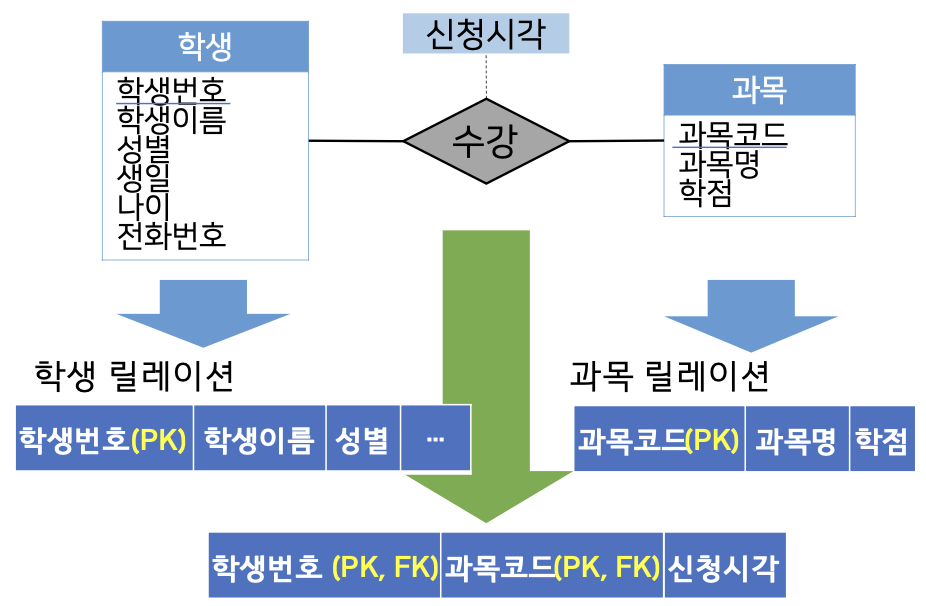
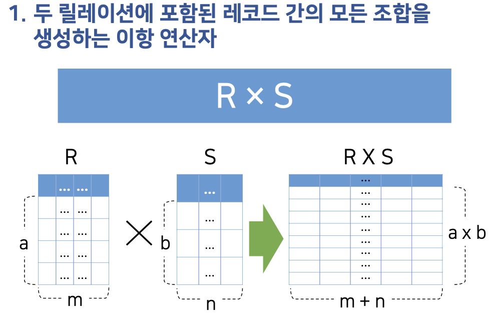
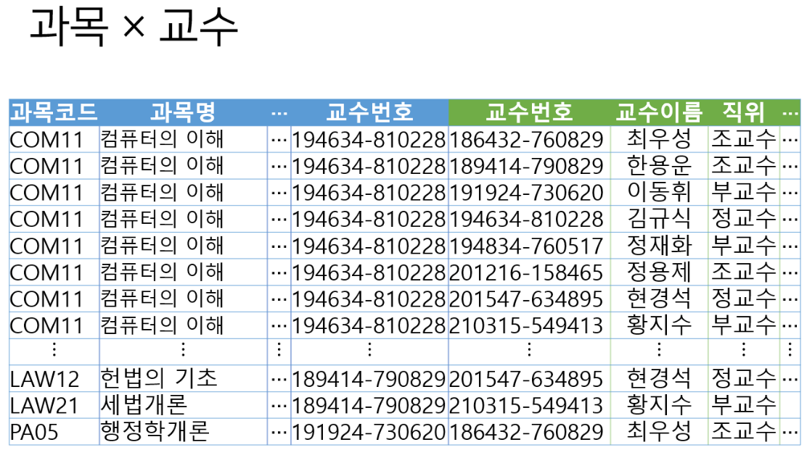

# 3. 관계형 모델

### 1. 관계형 데이터베이스 구조
1. 릴레이션
   1. 구성
   
   

   2. 용어와 의미 
      - 컬럼: 컬럼에 해당하는 값의 집합
      - 레코드: 각 컬럼의 순서에 맞게 나열된 값의 집합
      - 영역(도메인): 컬럼이 가질 수 있는 값의 범위
      - 차수: 릴레이션에 존재하는 속성의 개수
      - 카디널리티: 릴레이션에 존재하는 레코드의 개수
   
   3. 특징
      - 레코드의 유일성: 중복된 레코드의 존재가 불가능
      - 레코드의 무순서성: 레코드의 순서는 의미가 없음
      - 컬럼의 무순서성: 컬럼은 순서가 없고, 이름과 값의 쌍
      - 컬럼값의 원자성: 모든 값들은 나눌 수 없는, 단 하나의 의미

   4. 키
      - 해당 릴레이션의 레코드를 유일하게 식별하는 역할
      - 속성
        1. 유일성
        2. 최소성
      - 종류
        1. 수퍼키: 유일성 만족
        2. 후보키: 유일성, 최소성 만족
        3. 기본키: 레코드의 구분을 위해 선택된 후보키
        4. 외래키: 참조된 다른 릴레이션의 기본키
      - 키는 NULL 값을 가질 수 없다.
      - 외래키나 일반 컬럼은 NULL을 가질 수 있다. 

2. 릴레이션 스키마
- 어떠한 테이블에서 사용되는 컬럼과 컬럼이 지니는 데이터 타입을 정의한 것

3. 관계형 모델의 제약조건
- 데이터의 의미를 보존하고 정확성을 유지하기 위해 일정 조건을 만족해야한다.
  1. 영역 제약조건
     1. 값에 대한 제약조건
     2. 컬럼에 해당되는 값이 사전에 정의된 가능한 값의 범위인 영역(domain)에 포함되며 원자적이여야 한다.
     3. 즉, 컬럼에 아무 값이나 넣는 것은 할 수 없다.
     4. 또한 의미가 분해 가능한 값을 입력할 수 없다.
  2. 키 제약조건
     1. 키는 레코드를 고유하게 구별하는 값으로 구성
  3. 개체 무결성 제약조건
     1. 어떠한 기본키 값도 NULL이 될 수 없음
  4. 참조 무결성 제약조건
     1. 반드시 존재하는 레코드의 기본키만 참조 가능
- NULL의 개념
  1. 입력된 적이 없는 값
  2. 적용 불가능한 값

### 2. 논리적 데이터 모델링
- DBMS의 구현 모델에 맞춰 데이터를 표현하는 과정
- 데이터 정의 언어로 기술된 개념 스키마 생성
- 논리적 데이터 모델링의 필요
  - 관계형 DBMS(RDBMS)의 구현 모델에 맞춰 데이터의 구조와 관계를 표현
  - 작성된 ERD를 RDBMS가 수용 가능하는 구조로 변환
- 
- 관계형 모델 변환 방법
  1. 개체 집합: 개체 집합은 릴레이션으로 변환
  2. 약한 개체 집합: 강한 개체 집합의 키 속성을 약한개체 집합의 릴레이션에 포함
  3. 일대일 관계: 두 릴레이션 중에서 한 릴레이션의 기본키를 다른 릴레이션에서 외래키로 참조
  4. 일대다 혹은 다대일 관계: ‘일’쪽의 기본키를 ‘다’쪽 릴레이 션에서 외래키로 참조
  5. 다대다 관계: 관계 릴레이션을 생성하고, 두 릴레이션의 기본키를 각각 참조하는 외래키를 복합키 형태의 컬럼으 로 구성
  6. 다중값 속성: 릴레이션의 기본키를 참조하는 외래키와 다중 값 속성으로 별도의 릴레이션으로 구성
  7. 관계 집합의 속성: 외래키가 위치한 릴레이션의 컬럼으로 삽입
- 
- 
- 

### 3. 데이터 조작(관계연산)
1. 개념
   1. 관계형 모델을 기반으로 구성된 릴레이션을 사용하여 새로운 릴레이션을 생성하는 표현
   2. 사용자의 관점에서 필요한 데이터를 릴레이션에서 추출하는 방법을 제공하는 도구
   3. 관계 대수(relational algebra)
      - 관계 연산을 정의하는 방법
      - 주어진 릴레이션에서 필요한 릴레이션을 만드는 연산자(∪, ∩, -, σ, π, x, ⋈, ÷, 집계함수 등)로 구성
      - 관계 대수 연산자는 새로운 임시 릴레이션을 생성
      - 연산자를 중첩하여 연산 처리 절차를 표현
2. 기본 연산자
   1. 셀렉트
      - 
      - 
   2. 프로젝트
      - 
      - 
   3. 집합 연산자
      -  
      1. 합집합
      2. 차집합
      3. 교집합
      4. 리네임
      5. 카티션 프로덕트
         -  
         -  
         -  
      6. 조인
         -  
         -  
         -  
         -  
         -  
         -  
3. 확장 연산자
   - 기본연산자만 사용할 경우 표현식이 지나치게 길어지고 복잡해질 수 있기 때문에
   - 가독성이 떨어지는 단점이 생긴다
   - 이는 확장 연산자를 사용하여 해결한다.
   1. 자연 조인 연산자
   2. 할당 연산자
   3. 집계 함수 연산
      -  
      - 
      - 
      - 
