# 4. SQL

### 1. 개요
- 사람과 DBMS간의 의사소통을 위한 언어.
- 비절차적 언어
- 선언형 언어
  - 원하는 것을 명시
  - 원하는 정보를 얻기위한 절차는 기술하지 않음
- SQL 구성
  - 데이터 정의 언어(**DDL**: Data Definition Language)
    - 데이터베이스내의객체를생성및삭제하고그구조를 조작하는 명령어의 집합
    - 데이터가 준수해야 하는 제약조건을 기술
    - CREATE, ALTER, DROP 문 등
  -  데이터 조작 언어(**DML**: Data Manipulation Language)
     - DDL에 의해 정의된 테이블에 데이터를 조작하는 명령어의 집합
     - 데이터에 대한 CRUD(생성, 검색, 삭제, 수정) 명령을 포함
     - INSERT, UPDATE, DELETE, SELECT 문 등
  - 데이터 제어 언어(DCL, Data Control Language)
    - DBMS의 동작 설정 및 DBMS 접근에 대한 사용자의 권한을 관리하는 SQL 명령어의 집합
    - 주로 DBA가 사용
    - GRANT, REVOKE, BEGIN 문 등
  
### 2. 데이터 정의 언어
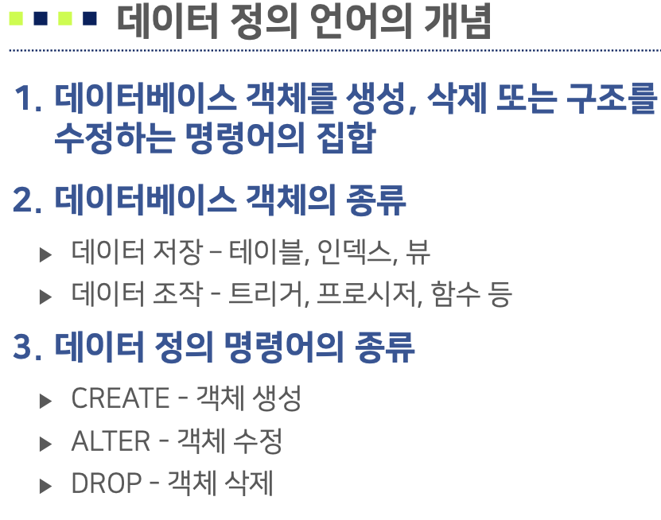

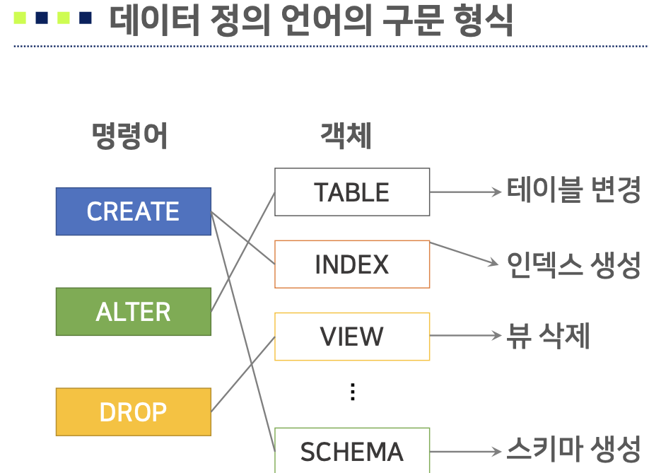

1. 스키마 정의
   1. 스키마 = 데이터베이스
   2. 한 조직의 데이터베이스 시스템의 운영에 필요한 테이블, 인덱스, 뷰 등의 데이터베이스 객체의 집합
   3. 스키마 관리 방법
      1. Forward Engineer
      2. SQL 에디터
      3. 내비게이터 패널
   4. 스키마 구문 형식
      1. 스키마 생성: ```CREATE SCHEMA 스키마이름```
      2. 스키마 삭제: ```DROP SCHEMA 스키마이름```
2. 테이블 정의
   1. 테이블 생성
```sql
CREATE TABLE 테이블이름( 
  <컬럼1><데이터타입1> [제약조건1] [ , 
  <컬럼2><데이터타입2> [제약조건2] ]
            ...              [ , 
  <컬럼n><데이터타입n> [제약조건n] ]
  [PRIMARY KEY 컬럼명]
  [UNIQUE 컬럼명]
  [FOREIGN KEY 컬럼 REFERENCES 테이블이름(컬럼)]
)
```
   2. 데이터 타입
      1. 개념 
         1. 컬럼이 가질 수 있는 값의 범위, 즉 도메인을 결정
         2. 프로그래밍 언어에서의 변수를 생성하는 데이터 타입의 사용목적과 방법이 매우 유사
         3. 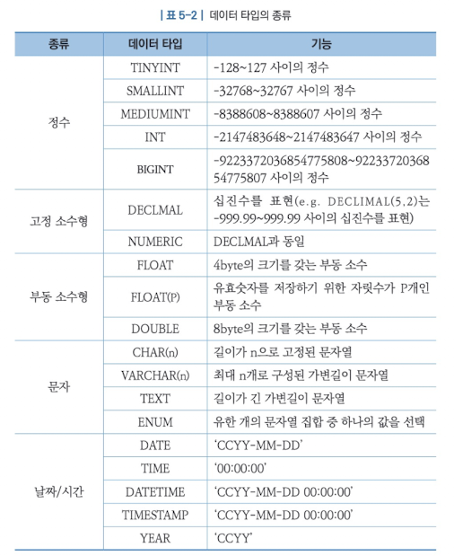
   3. 테이블 수정 
      1. 생성된 테이블에 컬럼을 추가, 수정(이름, 데이터 타입, 제약조건) 또는 삭제하는 명령
      2. 컬럼 삭제 또는 컬럼의 데이터 타입 수정 시 데이터에 대한 소실이 발생하므로 많은 주의가 요구
      3. 테이블 수정 방법
         1. SQL구문
         2. 내비게이터 패널
      4. 테이블 수정 구문 형식
      ```sql
      ALTER TABLE 테이블이름
        [ADD COLUMN 컬럼 데이터타입 [제약조건]] -- 주어진 컬럼 이름과 데이터 타입에 해당하는 새로운 컬럼 추가
        [DROPCOLUMN컬럼이름] -- 지정된 컬럼을 테이블에서 삭제
        [CHANGECOLUMN수정전컬럼 수정후컬럼] -- 컬럼의 이름이나 데이터 타입 또는 제약조건 변경
        [MODIFYCOLUMN컬럼 데이터타입] -- 컬럼의 데이터 타입 변경
      ```

   4. 테이블 삭제
      1. 존재하는 테이블을 스키마에서 삭제
      2. 삭제할 테이블의 모든 데이터가 소실, 복구가 불가능 연산이므로 각별한 주의가 요구
      3. 테이블 삭제 방법
         1. SQL구문: ```DROP TABLE 테이블이름```
         2. 내비게이터 패널

3. 제약조건
 
   -  테이블과 테이블에 존재하는 데이터를 보다 무결하게 관리하기 위한 목적으로 사용
   -  DBMS는 테이블 조작 시 테이블에 정의된 제약조건을 만족시키는지 지속적으로 검사
   -  DBMS는 적용하려는 제약의 유형에 따라 다양한 제약 조건을 지원
   1. 제약조건의 종류
      1. PRIMARY KEY: 기본키 지정, UNIQUE와 NOT NULL 특성
      2. FOREIGN KEY: 외래키 지정, 참조 컬럼 정의
      3. NOT NULL: NULL이 될 수 없는 컬럼에 지정
      4. UNIQUE: 동일한 컬럼값을 가질 수 없음을 지정
      5. AUTO_INCREMENT: 레코드가 추가될 때 자동적으 로 속성값이 1부터 1씩 증가되어 입력
      6. CHECK: 컬럼값이 특정 조건 준수 여부 지정
      7. DEFAULT: 해당 컬럼에 어떤 값이 입력되지 않으면 자동으로 지정된 값이 입력되도록 하는 조건

### 3. 데이터 조작

- **DML**: Data Manipulation Language
- 정의된 테이블에 레코드를 삽입·수정·삭제 및 검색하는데 사용되는 명령어의 집합
- 명령어의 종류
  - INSERT: 테이블 스키마에 적합한 레코드를 삽입
  - UPDATE: 테이블에서 조건을 만족하는 특정 레코드의 컬럼값을 수정
  - DELETE: 테이블에 조건을 만족하는 특정 레코드를 삭제
  - SELECT: 조건을 만족하는 레코드를 테이블에서 검색

1. INSERT

- 테이블에 새로운 레코드를 삽입하는 명령문
- 테이블에 새로운 레코드를 삽입
- 모든 속성 또는 부분 속성에 대한 속성값을 삽입

```sql
-- (1)
INSERT INTO 테이블이름
VALUES(값 , 값 ,...값 )

-- (2)
INSERT INTO 테이블이름(컬럼1, 컬럼2,...컬럼n)
VALUES(값1, 값2, ...값n)
```

2. UPDATE

- 조건을 만족하는 레코드의 특정 컬럼값을 수정

```sql
-- (1)
UPDATE 테이블이름
SET 컬럼1=값1 [,컬럼2=값2 ,...,컬럼n=값n]
[WHERE 조건]

-- (2)
UPDATE 테이블_이름
SET 컬럼1=수식1 [,컬럼2=수식2 ,...,컬럼n=수식n]
[WHERE 조건]
```

3. DELETE
  
- 조건에 일치하는 레코드 집합을 테이블에서 삭제할 때 사용하는 명령어

```sql
DELETE FROM 테이블이름 [WHERE 조건]
```

4. SAFE UPDATES 모드
   1. WHERE절이 없는 UPDATE/DELETE 문은 테이블의 전체 레코드를 변경/삭제
   2. 의도하지 않은 데이터 변경/삭제 방지를 위해 MySQL은 SAFE UPDATES 모드를 지원
   3. 기본키가 아니 컬럼을 대상으로 수정/삭제 조건을 명시할 경우 실행 여부를 결정
   
   ```sql
   SET SQL_SAFT_UPDATES = 0 | 1
   ``` 

5. SELECT

- 한 개 이상의 테이블에서 주어진 조건에 만족하는 레코드를 출력하는 명령문
- 관계 대수의 셀렉션, 프로젝션, 조인, 카티션 프로덕트 연산자의 기능을 모두 포함하고 있는 명령문
- 필수적 절인 SELECT 절과 부가적인 목적으로 사용할 수 있는 여러 절을 혼합하여 검색 기능을 구체화

```sql
SELECT [DISTICT] 컬럼1,컬럼2, ..., 컬럼n
  FROM 테이블1 [INNER JOIN | OUTER JOIN
       테이블2, INNER JOIN | OUTER JOIN
       ON 조인 조건1
       테이블3
       ...,   INNER JOIN | OUTER JOIN
       테이블m]
  [ON 조인 조건식]
  [WHERE 조건식 [중첩질의]] 
  [GROUP BY 컬럼1, 컬럼2, ...., 컬럼y
    [HAVING 조건]]
  [ORDER BY 컬럼1 [ASC|DESC], ..., 컬럼z [ASC|DESC]]  
```

- SELECT 절 – 결과에 포함되는 컬럼을 지정
- FROM 절 – 질의를 적용할 테이블을 지정
- ON/WHERE 절 – 조인 조건/검색할 레코드 조건을 지정
- GROUP BY 절 – 레코드를 그룹화하기 위한 그룹 조건을 지정
- HAVING 절 – GROUP BY 절이 적용된 결과에 대한 조건을 지정
- ORDER BY 절 – 검색 결과의 정렬 기준을 지정

  1. 단순질의문

  - 레코드를 제한하지 않고 전체 테이블을 검색하는 SELECT 문으로 WHERE 절이 없는 질의문

  ```sql
  -- (1)
  SELECT 컬럼1, 컬럼2, ..., 컬럼n
    FROM 테이블

  -- (2)
  SELECT *
    FROM 테이블
  ```

  2. 조건질의문

  - 산술연산식, 함수 등을 사용하여 표현한 조건을 WHERE 절에 기술하여 조건을 만족하는 레코드만 검색하는 SELECT 문
    - 산술연산자 
    - 비교연산자 
    - 논리연산자
  - WHERE 절은 UPDATE, DELETE 문에서도 동일하게 적용

  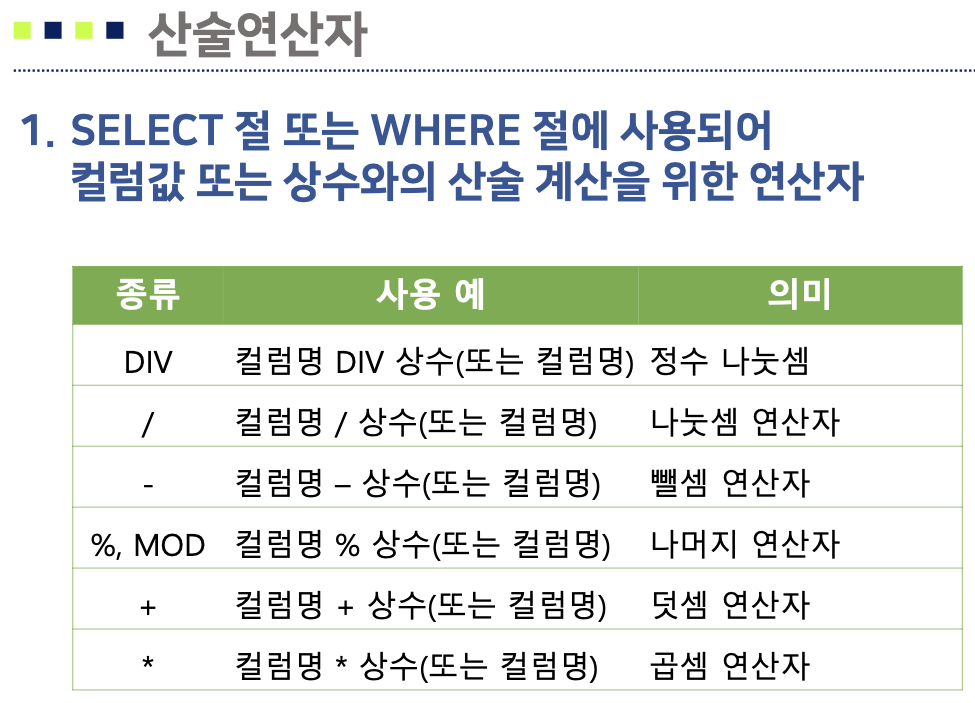

  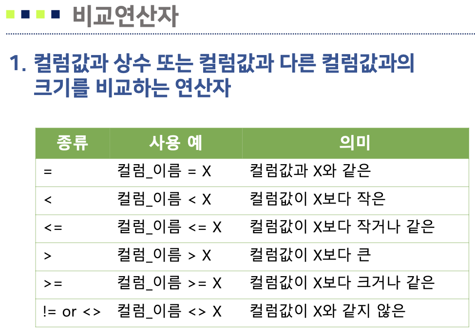

  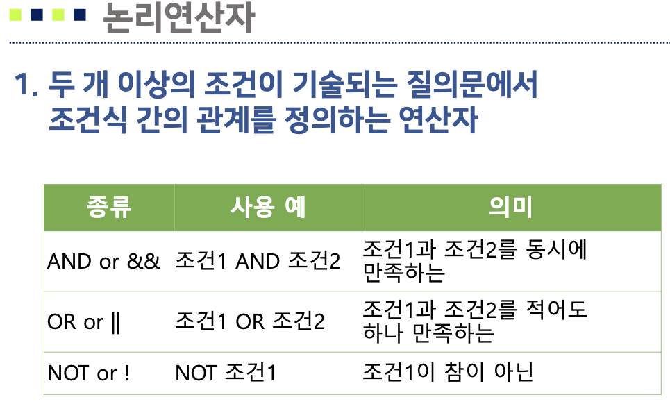

6. 데이터 정렬

- ORDER BY 절을 사용
- 검색 결과를 특정 컬럼에 대해 오름차순 또는 내림차순으로 정렬
  - 오름차순: ASC
  - 내림차순: DESC

```sql
SELECT 문 형식
  ORDER BY 컬럼1 [ASC|DESC],
                  ...     ,
           컬럼2 [ASC|DESC]
```

7. 집합 연산이 포함된 SELECT

```SQL
SELECT문1 UNION | UNION ALL SELECT문2

-- example
(SELECT 컬럼1
  FROM 테이블1
  WHERE 컬럼1='foo')
UNION
(SELECT 컬럼2
  FROM 테이블2
  WHERE 컬럼2='bar')
```

8. 특수연산자

- 범위 포함 여부, 부분 일치 여부, 포함 여부 등 관계형 데이터베이스에서만 사용되도록 고안된 연산자

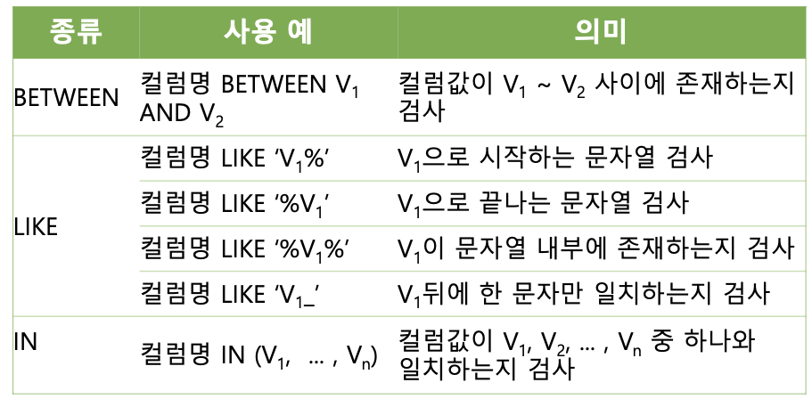

```sql
-- 범위 예제
SELECT 컬럼
  FROM 테이블
  WHERE 컬럼 >= 200000 AND 컬럼 <= 400000
-- 범위 예제(BETWEEN 사용)
SELECT 컬럼
  FROM 테이블
  WHERE 컬럼 BETWEEN 200000 AND 400000

-- 논리합 예제
SELECT 컬럼
  FROM 테이블
  WHERE 컬럼 = "값1" OR 
        컬럼 = "값2" OR
        컬럼 = "값3"
-- 논리합 예제(IN 사용)
SELECT 컬럼
  FROM 테이블
  WHERE 컬럼 IN ("값1", "값2", "값3")

-- boo로 부분일치검색 예제(LIKE 사용)
SELECT 컬럼
  FROM 테이블
  WHERE 컬럼 LIKE 'boo%'
```

9. 기타 SELECT

  1. 별칭

  ```sql
  변경전 이름 as 변경후 이름
  ```

  2. NULL 값
  3. 함수의 활용  
  - 특정 목적을 수행하도록 사전에 정의된 연산 및 기능을 수행한 후 결과값을 반환하는 명령어 집합
  - 상용 DBMS는 검색결과가 사용자에게 여러 형태로 사용되도록 여러 데이터 타입에 대한 다양한 함수를 제공(MySQL 기준)
    - 문자함수
    - 숫자함수
    - 날짜 및 시간함수
  
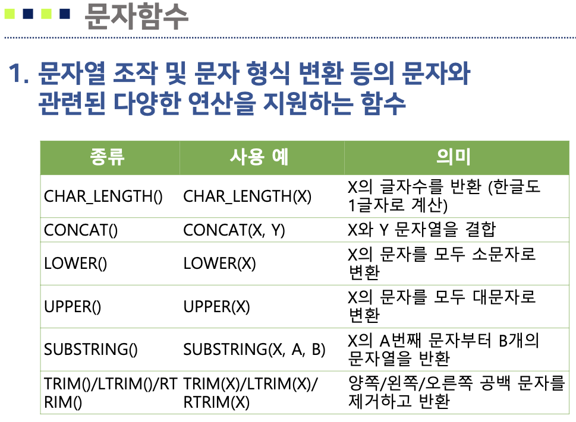

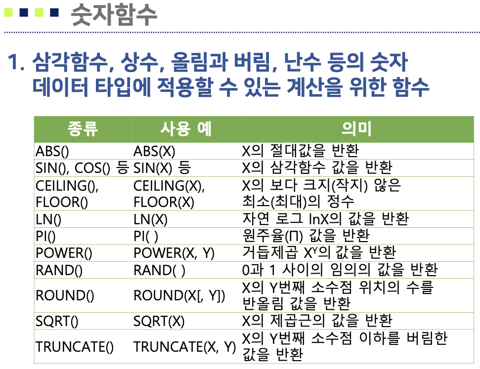

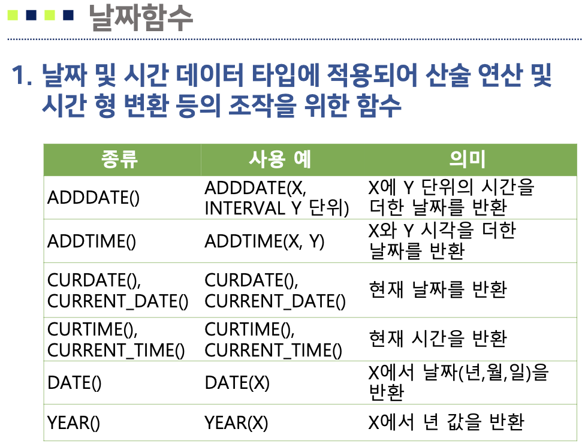

10. 고급 SELECT

    1. 집계 함수

      - 특정 컬럼에 집계함수를 통해 다양한 통계 연산을 수행할 수 있는 기능
      - SELECT 절 또는 HAVING절에 기술 
      - 집계 함수의 종류
        - COUNT: 컬럼에 있는 값들의 개수
        - SUM: 컬럼에 있는 값들의 합
        - AVG: 컬럼에 있는 값들의 평균
        - MAX:컬럼에서가장큰값
        - MIN: 컬럼에서 가장 작은 값
        
        ```sql
        -- COUNT 예제
        SELECT COUNT(COL1) AS COUNT_COL FROM TABLE1
        ```

    2. 그룹 질의
    - 특정 기준으로 레코드를 그룹화하고 각 레코드 그룹에 대해 집계 함수를 적용하는 질의
    - 구문형식
      ```sql
      SELECT 질의 GROUP BY 컬럼
      -- 예제
      SELECT 컬럼, COUNT(*) AS 컬럼수
        FROM 테이블
        GROUP BY 컬럼
      ```
    - **[주의] SELECT 절에 그룹의 기준과 집계 함수 이외의 컬럼은 포함될 수 없음**

    3. HAVING 절
    - 그룹 질의의 결과 레코드에 대해 출력 조건을 기술하기 위한 절
    - 구문형식
      ```sql
      SELECT 질의 GROUP BY 컬럼 HAVING 조건
      ``` 
    - 조건 기술 절
      - WHERE: 레코드에 대한 조건을 기술
      - HAVING: 집계 결과 레코드에 대한 조건을 기술

    4. 중첩 질의 활용
    - SELECT 문 내부에서 독립적으로 실행 가능한 또 다른 SELECT 문이 내포되어 있는 질의
    - 일반적으로 내부 질의의 처리결과를 외부 질의에서 재사용
    - 중첩 질의의 종류
      - FROM 절에서의 중첩 질의 활용
        - FROM 절에서의 결과 집합을 SELECT에서 재검색
      - WHERE 절에서의 중첩 질의 활용
        - WHERE 절에서의 결과 집합을 활용하여 외부 질의에서 레코드의 출력 여부를 결정
        - IN, NOT IN, EXISTS, NOT EXSISTS 사용
    - 구문 형식
      ```sql
      -- (1)
      SELECT 컬럼1, 컬럼2, ..., 컬럼n
        FROM(SELECT 컬럼1, 컬럼2, ..., 컬럼n
              FROM 테이블 
              WHERE 조건)
        WHERE 조건
      -- (2)
      SELECT 컬럼1, 컬럼2, ..., 컬럼n
        FROM 테이블1
        WHERE 컬럼i 연산자 (SELECT 컬럼j
                          FROM 테이블2
                          WHERE 조건)
      ```
    5. 교집합과 차집합 연산
    6. EXISTS와 NOT EXISTS
    - EXISTS는 외부 질의의 각 레코드에 대해 내부 질의의 결과에 레코드가 존재하면 참을 반환하고 존재하지 않으면 거짓을 반환.
    - NOT EXISTS는 EXISTS와 반대

11. 조인 연산을 이용한 SELECT
- 테이블 간의 관련성을 이용하여 두 개 이상의 테이블에서 데이터를 검색하는 질의 기법
- ER 모델링 및 정규화 기법으로 여러 테이블로 분리된 정보를 통합하여 검색 시 유용
- 조인 질의의 종류
  - 내부조인
    - 두 개 이상의 테이블에서 조인 조건을 만족하는 레코드 만 결합하여 출력 결과에 포함시키는 연산
    - 조인 조건은 WHERE 절이 아닌 ON 절에 기록
    - ANSI SQL 표준과 사실상의 표준인 Oracle사가 제안한 조인 형식이 사용
    - 구문
      ```sql
      -- 내부조인
      SELECT 컬럼1, 컬럼2, ..., 컬럼n
        FROM 테이블1 INNER JOIN 테이블2
        ON 조인조건1
        [WHERE 조건]
      ```
  - 자연조인
    - 두개 이상의 테이블을 하나의 테이블로 결합하는 내부 조인과 매우 유사한 기능
    - 두 테이블에 **동일한 이름의 컬럼**에 대해 값이 같은 레코드를 결합하는 내부 조인
    - 구문
      ```sql
      SELECT 컬럼1, 컬럼2,...,컬럼n
        FROM 테이블1 NATURAL JOIN 테이블2
        [WHERE 조건]
      ```
  - 외부조인
    - 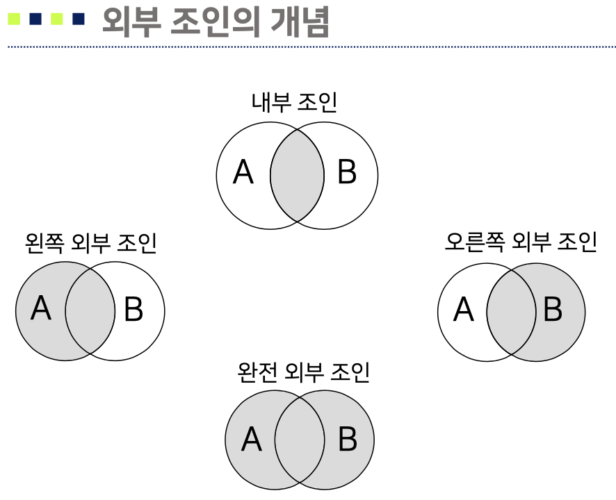
    - 내부 조인(inner join)은 조인조건에 일치하는 레코드만 결합하여 결과를 생성
      - 조인 결과에 정보의 손실이 발생
    - 외부 조인은 조인조건에 맞지 않는 레코드도 질의의 결과에 포함시키는 질의
    - 외부 조인의 종류
      - 왼쪽 외부 조인(left outer join)
      - 오른쪽 외부 조인(right outer join)
      - 완전 외부 조인(full outer join)
    - 구문
      ```sql
      SELECT 별칭1.컬럼1, 별칭1.컬럼2, ..., 별칭1.컬럼n,
             별칭2.컬럼1, 별칭2.컬럼2, ..., 별칭2.컬럼m
        FROM 테이블1 AS 별칭1
             LEFT|RIGHT [OUTER] JOIN 
             테이블2 AS 별칭2
        ON 별칭1.컬럼i=별칭2.컬럼j
        [WHERE 절] 
      ```
  - 셀프조인
    - 한 테이블이 자기 자신과 조인되는 형태
    - 동일한 이름의 테이블에 대한 조인이므로 반드시 테이블 이름에 대한 **별칭이 의무적으로 사용**
    - 구문
      ```sql
        SELECT 별칭1.컬럼1, 별칭1.컬럼2, ..., 별칭1.컬럼n,
               별칭2.컬럼1, 별칭2.컬럼1, ..., 별칭2.컬럼m
          FROM 테이블1 AS 별칭1
               INNER|OUTER JOIN 테이블2 AS 별칭2
          ON 조인조건 
          [WHERE 절]
      ```

### 4. 뷰
- 데이터를 저장하고 있는 하나 이상의 테이블을 유도하여 생성하는 가상의 테이블(virtual table)
- 물리적으로 저장되지 않는다.
- 장점
  - 데이터 독립성: 원본 테이블의 구조가 바뀌어도 뷰를 이용한 작업은 정의만 변경되어 응용 프로그램에 영향이 없음
  - 데이터 보안: 사용자에게 원본 테이블의 일부 컬럼에 대한 접근을 허용하여 보안 효과를 향상
  - 다양한 구조의 테이블 사용: 사용자의 요구사항에 맞는 테이블의 구조를 제공
  - 작업의 단순화: 복합한 질의문을 뷰로 단순화
  - 데이터 무결성: WITH CHECK OPTION을 이용하여 뷰 생성에 위배되는 수정작업을 거부

1. 뷰의 생성
   - 생성되는 뷰의 구조는 SELECT 문의 결과로 결정
      ```sql
      CREATE VIEW 뷰이름 AS
        ( SELECT 컬럼1, 컬럼2, ..., 컬럼n
            FROM 테이블
            [WHERE 조건] ) 
      [WITH CHECK OPTION]
      ```

2. 뷰의 수정
   - 뷰의 수정은 생성과 동일하게 새로운 SELECT 문의 결과로 변경
      ```sql
      ALTER VIEW 뷰이름(컬럼1, 컬럼2, ..., 컬럼n ) AS
        ( SELECT 컬럼1, 컬럼2, ..., 컬럼n
                FROM 테이블 
                [WHERE 조건] )
      ```
3. 뷰의 삭제
   ```sql
   DROP VIEW 뷰이름
   ```
4. 뷰와 관련된 데이터 조작
```sql
-- 구문형식
SELECT * FROM 뷰 이름 [WHERE 조건]
-- 실행형식
SELECT 컬럼1, ..., 컬럼2 FROM 뷰이름 WHERE 조건 AND 뷰 정의 조건
```
- 뷰에 대한 INSERT 문은 원본 테이블에서 실행
- PRIMARY KEY, NOT NULL 등의 제약사항이 위배되는 경우 삽입이 불가능
- 원본 테이블에 존재하는 컬럼이지만 뷰에는 없는 컬럼에 삽입하는 경우 실행 불가능
- 조인 질의 또는 그룹 질의가 적용된 뷰는 데이터 삽입 및 수정이 불가능
- WITH CHECK OPTION이 적용된 뷰는 위배되는 사항은 없지만 뷰에 맞지 않는 조건일 경우 실행 불가능