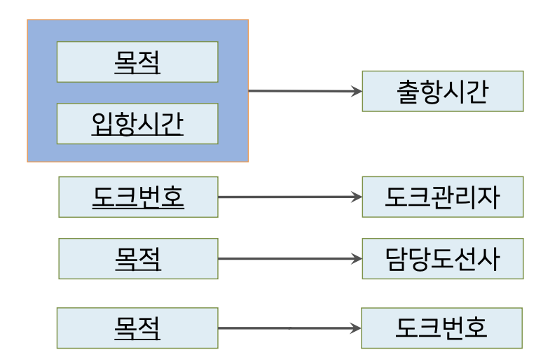

# 5. 정규화

### 1. 좋은 릴레이션과 나쁜 릴레이션
- 데이터 중복의 문제점
  - 일관성 유지의 어려움
  - 저장 공간 낭비
- 정규형의 효용성
  - 한 릴레이션 내의 걸림들 간의 관계 표현
  - 불필요한 데이터의 종속과 중복 제거
  - 새로운 컬럼 추가시 기존 컬럼과의 관계 수정을 최소화
- 갱신 이상
  - 삽입이상
    - 레코드 추가시 불필요한 컬럼의 값이 없이는 추가하지 못 하는 경우
    - 
  - 삭제이상
    - 삭제시 의도하지 않았던 다른 데이터가 삭제되는 경우
    - 
  - 수정이상
    - 중복 저장된 레코드를 수정시 모두 반영이 안되어 데이터베이스의 일관성이 깨지는 경우
    - 
- 좋은 릴레이션의 개념 
  - 컴퓨터 프로그래머적 관점에서의 모델링
    - **어떻게 데이터를 저장해야 하는가?**
  - 릴레이션의 스키마가 얼마나 효율적으로 실세계를 반영하고 있는지 평가
  - 고려사항
    - 한릴레이션내의컬럼간의관계분석
    - 원하지 않는 데이터의 종속과 중복 제거
    - 새로운 컬럼들이 데이터베이스에 추가될 때, 기존 컬럼과의 관계 수정을 최소화
  - 

### 2. 함수적 종속성

1. 정의

- 데이터베이스 모델링 시 잘못 설계된 릴레이션을 구성하는 속성들 간의 연관관계를 검사하고,
- 이를 기반으로 릴레이션이 특정 정규형을 만족하도록 정규화하는데 중요한 역할을 함.
- 릴레이션 인스턴스를 분석하여 속성들 간의 연관관계를 표현한 것
- 릴레이션의 효율성을 향상시켜 좋은 릴레이션으로 변환하는데 이용되는 중요한 개념
- 
- 
- 각 레코드가 특정 속성 X에 대해 유일한 속성값을 가지면 X는 릴레이션 내의 모든 속성을 함수적으로 결정할 수 있음.
- 예를 들어 후보키는 릴레이션의 모든 투플들을 유일하게 구분할 수 있기 때문에 릴레이션의 모든 속성에 대한 결정자가 될 수 있음.
- 함수적 종속성은 릴레이션 내부에 반복적으로 나타나는 속성값들의 짝을 나타내기 때문에 


1. 함수적 종속성의 추론 규칙과 카노니컬 커버

- 존재하는 모든 함수적 종속성을 추출하는 것이 중요함.
- 함수적 종속성을 검사하면 어느 속성에 의하여 중복되는 데이터가 발생하는지 알 수 있다.
- 함수적 종속성은 릴레이션의 효율성 여부에 중요한 판단기준
- 그러나 릴레이션의 인스턴스만으로 내재된 모든 함수적 종속성을 찾아내기 어려움
- 판별되지 않은 모든 함수적 종속성을 찾기 위해 추론 규칙을 사용하여 함수적 종속성을 확장 및 유추
- 클로저(closure)
  - 판별된 함수적 종속성 집합으로부터 유추할 수 있는 모든 함수적 종속성 집합
  - 릴레이션 스키마 R의 함수적 종속성 집합 = F
  - F로 부터 유추할 수 있는 모든 종속성 집합을 F의 클로저라고 하고
  - F+로 표기
- 논리적 오류와 모순을 재배하고 새로운 종속성을 찾아내기 위한 추론규칙
  - 암스트롱의 추론 규칙
  - 
- 카노니컬 커버
- 불필요한 함수적 종속성을 제거한 표준형으로 변환 후 정규화를 수행
- 표준형 조건
  - 𝐹의 모든 함수적 종속성의 오른편 속성은 반드시 1개
  - 𝐹에서 𝑋→𝐴를 𝑋의 진부분집합 𝑌에 대하여 𝑌→𝐴로 교체했을 때, 그 집합이 𝐹와 동등한 집합이 불가능
  - 𝐹에서 어떤 함수적 종속성을 제거했을 때, 그 집합이 𝐹와 동등한 집합이 불가능

### 3. 기본 정규형
- 이상 현상을 최소화 하도록 특정 조건을 갖춘 릴레이션의 형식
- 특정 정규형의 조건을 만족하도록 릴레이션과 속성을 재구성하는 과정
- 제1정규형에서 제5정규형으로 수준이 높아질수록 구조화 조건이 까다로워지며
- 데이터 중복이 최소화 된다.
- 정규화의 목적
  1. 데이터베이스 내에 모든 릴레이션을 효과적으로 표현
  2. 보다 간단한 관계 연산에 기초하여 검색 알고리즘을 효과적으로 작성할 수 있도록 지원
  3. 바람직하지않은삽입,수정,삭제등의이상발생방지
  4. 새로운 형태의 데이터가 삽입될 때 릴레이션 재구성의 필요성을 축소

1. 제1정규형
  - 정의
    - 어떤 릴레이션 스키마에서 정의된 모든 속성의 도메인이 원자값을 가지면 제1정규형이다.
  - 모든 레코드는 각 속성에 대해서 해당 속성의 타입에 맞는 단일값을 가진다.
  - 관계형 모델에 조건에 따라 자동 적용되는 정규형

2. 제2정규형
   - 정의
     - 릴레이션이 제1정규형을 만족하고 기본키가 아닌 속성들이 기본키에 완전 함수 종속되면(부분 종속성을 제거하면) 제2정규형이다.
   - 함수적 종속성 다이어그램
     - 릴레이션 내의 속성간의 종속 관계를 직관적이고 이해하기 쉽게 도식화 한 표현 방식
       - 직사각형: 속성 또는 속성 집합
       - 화살표: 함수적 종속성
       - 
   - 함수적 종속성 X→Y 에 대한 종류
     - 부분 함수적 종속: 속성 집합 Y가 속성 집합 X 일부분에 함수적으로 종속되는 상태
     - 완전 함수적 종속: 속성 집합 Y가 속성 집합 X 전체에 함수적으로 종속되는 상태
   - 부분 함수적 종속으로 인해 정보의 중복이 발생할 수 있다.
   - 이를 위한 무손실분해가 필요하다
   - 무손실 분해
     - 정의
       - ```스키마 𝑅에 함수적 종속성 𝑋→𝑌가 존재하고 𝑋∩𝑌=∅ 이면, 𝑅을 𝑅−𝑌와 𝑋𝑌로 분해```
   - 적용
     - 제2정규화적용
     - 
     - 
     - 제2정규화의 함수적 종속성 다이어그램
     - 
     - 

3. 제3정규형
   - 정의
     - 릴레이션이 제2정규형을 만족하고, 기본키가 아닌 속성들이 어떤 키에도 이행적으로 종속되지 않을 때 제3정규형이다.
     - 이행적 종속성: ```𝑋→𝑌이고 𝑌→Z이면 𝑋→Z이다```
   - 적용
     - 
     - 
     - 
     - 
     - 
  
4. BC정규형
   - 정의
     - 릴레이션이 제3정규형을 만족하고 릴레이션에서 성립하는 𝑋→𝑌 형태의 모든 함수적 종속성에 대하여 X가 수퍼키이면 BC정규형이다.
   - 앞선 정규형에서는 
     - 부분 함수 종속 제거
     - 이행적 종속성 제거
   - 를 통해 조건을 달성하지만
   - BC정규형은 기본키가 아닌 속성이 다른 속성을 결정하지 못하도록 제약한다.
   - 적용
     - 
     - 
     - 
     - 

5. 정리
   - 정규화는 
     - 데이터의 부분적 중복을 최소화
     - 이상 현상의 발생 가능성을 제거
   - 

### 4. 역정규화
- 정규화를 통한 스키마 설계는 연관성이 있는 정보를 나누어 다른 릴레이션으로 저장함.
- 이는 물리적으로 서로 다른 파일로 저장되는 것을 의미
- 여러 릴레이션에 접근하는 질의가 요청될 경우 
- 연관된 모든 릴레이션에 각각 접근하게 되고
- 각각의 접근 비용 및 조인 비용이 추가적으로 발생 → 질의 응답 속도의 지연 발생
- 상황에 따라 정규화 이전의 상태로 되돌리는 작업이 필요할 수 있음.
- 역정규화
  - 정규화의 반대 과정
  - 정규화를 통해 분리되어던 릴레이션을 통합하는 구조의 재조정을 통해 부분적 중복을 허용함
  - 데이터 접근 성능을 개선하는 기법
  - ```비정규 릴레이션 != 역정규화 스키마```

1. 방법
   - 데이터 사용량이 많은 릴레이션을 우선적으로 선별
    1. 릴레이션의 병합
       - 1:N의 관계를 갖는 두 릴레이션의 경우 N쪽의 모든 데이터를 1에 통합한다.
    2. 릴레이션의 수직분할
       - 특정 릴레이션 내에서 빈번하게 접근하는 속성
       - 접근이 일어나지 않는 속성
       - 위 2개의 속성을 두 릴레이션으로 나눈다
    3. 릴레이션의 수평분할
       - 속성이 아닌 레코드를 기분으로 분할
    4. 유도 속성의 추가
       - 원래 설계한 릴레이션에는 유도가 가능하기에 
       - 없었던 속성이지만 효율을 위해 별도로 추가

2. 단점
   - 상황에 따라 시스템 성능저하가 생길 수 있음.
