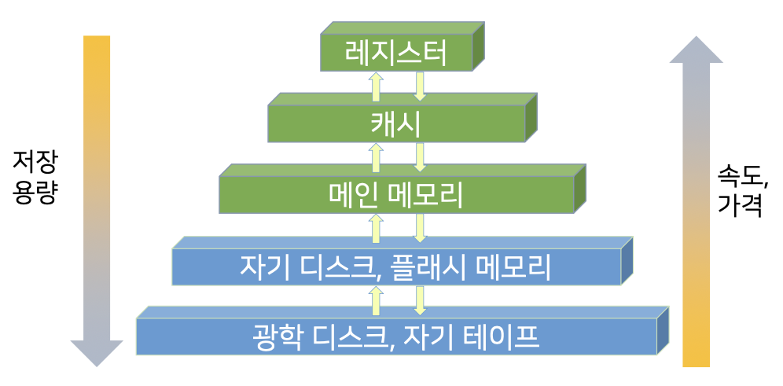
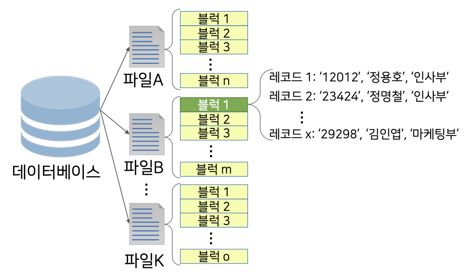
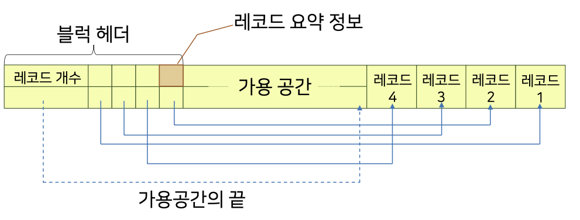
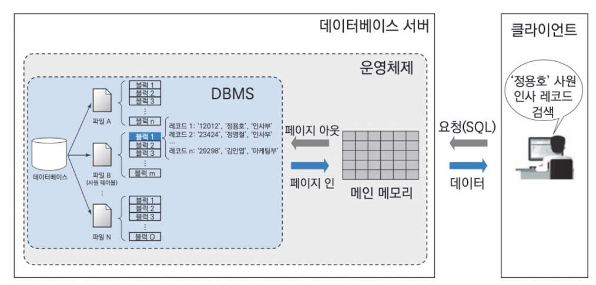

# 7. 데이터 저장과 파일

### 1. 물리적 저장장치 구조

1. 특징
   1. 휘발성
      1. 캐시: 고비용 저장장치로 빠른 접근 속도를 보장
      2. 메인 메모리: 실제 프로그램과 데이터 적재 공간
   2. 비휘발성
      1. 플래쉬 메모리: 메인 메모리와 유사하나 비휘발성
      2. 자기 디스크: 데이터베이스 전체를 안정적으로 저장
      3. 광학 디스크 드라이브: CD, DVD, Blue-ray등
      4. 테이프 장치: 용량이 크로 저렴하나 순차접근방식으로 접근 속도가 매우 느림

### 2. 파일

- 정의
   - 데이터를 영구적으로 저장하기 위해 사용되는 가장 기초적인 논리적 구조
- 블럭
   - 파일을 고정적인 길이로 분할하여 생기는 균등한 크기의 데이터 묶음
   - 일반적으로 메모리와 디스크간 데이터 전송 단위로 결정
- 레코드
   - 블럭을 구성하는 요소
   - 더 이상 분리될 수 없는 최소 데이터 저장 단위

1. 고정 길이 레코드
   1. 각 레코드에 고정적인 바이트 수를 할당하는 방법
   2. 특징
      1. 구현이 단순하고 탐색방법이 직관적
      2. 블럭의 길이가 레코드의 길이로 정확히 나눌 수 없다면, 레코드들은 다른 블럭에 나뉘어 저장된다.
      3. 레코드 삭제 작업 후 빈 공간에 대한 관리가 어렵다.
      4. **삭제와 삽입 등의 연산에 대한 동작은 배열과 비슷하다.**
   3. 레코드 삭제에 대한 추가적인 구조
      1. 가용 리스트
         1. 아직 사용되지 않은 공간
         2. 기존 레코드가 삭제되어 비어있는 공간
         3. 1,2에 해당하는 공간에 대한 정보를 관리하는 자료구조
      2. 파일 헤더
         1. 파일의 시작점에 있는 파일과 관련된 다양한 정보가 저장되는 공간
         2. 해당 공간에 가용 리스트 정보를 위치시킨다.
         3. 순서
            1. 새로운 레코드 삽입 시 파일 헤어가 가리키고 있는 빈 공간에 레코드 삽입
            2. 두번째 빈 공간의 주소를 파일 헤더에 저장
            3. 가용 리스트에 빈 공간이 없다면 파일의 맨 끝에 레코드 삽입

2. 가변 길이 레코드
   1. 블럭에 저장되는 레코드의 길이가 서로 다른(가변적) 레코드를 할당하는 방법
   2. 가변 길이 레코드가 사용되는 상황
      1. 한 블럭내에 저장되는 레코드 유형이 둘 이상
      2. 길이가 고정되지 않은 컬럼의 개수가 하나 이상
      3. 레코드가 **멀티셋**을 허용한 컬럼를 가질 때
         1. 멀티셋: 레코드의 컬럼 값이 여러 개인 컬럼
   3. 일반적으로 고정 길이 컬럼은 레코드의 앞쪽 부분에, 가변 길이 컬럼은 레코드의 뒤쪽 부분에 위치시켜 컬럼의 길이 변화에 필요한 작업을 최소화한다.
   4. 슬롯 페이지 구조
      1. 각 레코드의 길이가 불규칙하기 때문에 
      2. 레코드의 접근 및 관리를 위한 별도의 자료 구조가 필요
      3. 이에 대한 대표적인 구조
      4.       

3. 파일 구조

- 파일 수준에서 레코드를 관리(접근, 저장 등)하는 기법

   1. 파일 구조화 방법
      1. 힙
         1. 모든 레코드는 파일 내 임의의 블럭에 저장될 수 있는 방식
         2. 각 레코드들의 저장 순서를 고려하지 않음
      2. 순차
         1. 레코드들이 특정 컬럼에 대한 값을 기준으로 정렬되어 저장되는 방식으로
         2. 일반적으로 정렬키로 탐색키를 사용한다.
      3. 해시
         1. 해시 함수를 이용
         2. 해시 함수는 레코드 탐색키를 입력받아
         3. 레코드가 저장될 블럭 주소를 반환하고
         4. 해당 주소에 레코드를 저장
   2. 특징
      - 일반적으로 DBMS는 테이블의 물리적 구현이 상대적으로 쉬운
      - 순차 파일 구조
      - 해시 파일 구조
      - 를 사용하여 테이블을 구현한다

      1. 순차 파일 구조
         - 레코드가 검색키(탐색키, search key) 순서대로 정렬
         - 레코드가 파일에 삽입되는 시점에서 키 값이 부여
         - 장점
           - 검색키에 대한 정렬 연산이 불필요, 키 값들의 순서로 레코드를 판독하는 연산에 효율적
           - 현재 레코드에서 정렬된 키순서로 다음 레코드를 찾을때 부가적인 블럭 접근이 불필요
           - 이진 탐색을 사용하면 더 빠르게 레코드를 검색
         - 단점
           - 검색키가 아닌 컬럼의 값을 이용하여 탐색하는 것은 비효율적
           - 레코드 삽입, 삭제에 많은 비용 소요
         - 오버플로 블럭
           - 레코드가 물리적으로 정렬된 상태로 유지되어야 하므로 
           - 레코드 삽입 시 순차 컬럼값(탐색키)을 기반으로 삽입할 블럭을 찾고,
           - 그 위치에 삽입할 충분한 공간이 있으면 삽입을 완료한다.
           - 만약 공간이 없다면 신규 블럭에 삽입하고 
           - 신규 레코드의 이전 레코드가 신규를 링크하고
           - 신규 레코드 다음레코드를 신규레코드가 링크하도록 포인터가 재조정한다.
           - 레코드 삽입을 위해 사용한 신규 블럭을 오버플로 블럭이라고 한다.

### 3. 저장장치 접근

1. 저장장치의 접근
   - 파일은 논리적 관점에서의 저장 객체
   - 실제 저장될 때에는 여러 개의 물리적 단위인 블럭으로 저장
     - 블럭은 메모리와 디스크 간 데이터의 전송 단위
     - 일반적으로 2KB ~ 32KB 사용
     - 블럭 전송을 최소화 할 수록 입출력 소요 시간이 단축
       - 사용 중인 블럭을 지속적으로 메모리에 적재
       - 한정적 공간으로 인하여 필요에 따라 특정 블럭 할당을 해지
       - 메모리 내부에 버퍼라는 공간에 블럭을 저장하고, 이를 관리하기 위한 버퍼 관리자를 사용
       - 

2. 버퍼 관리자